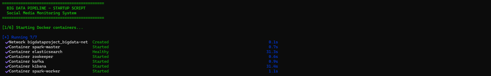
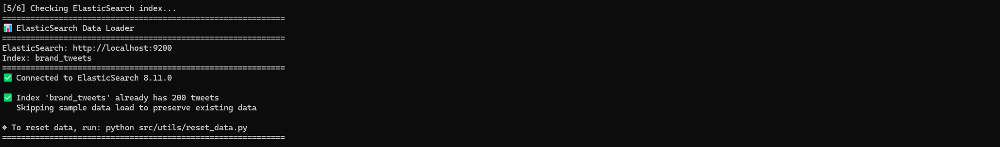
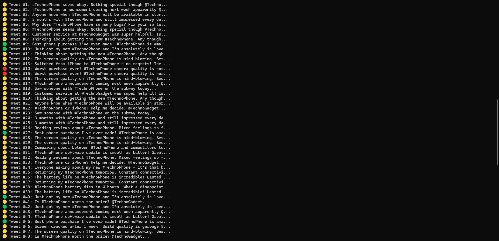
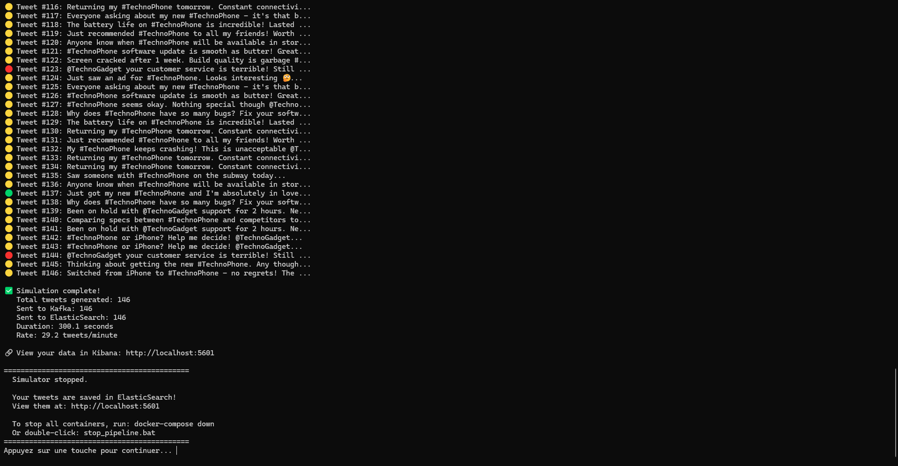
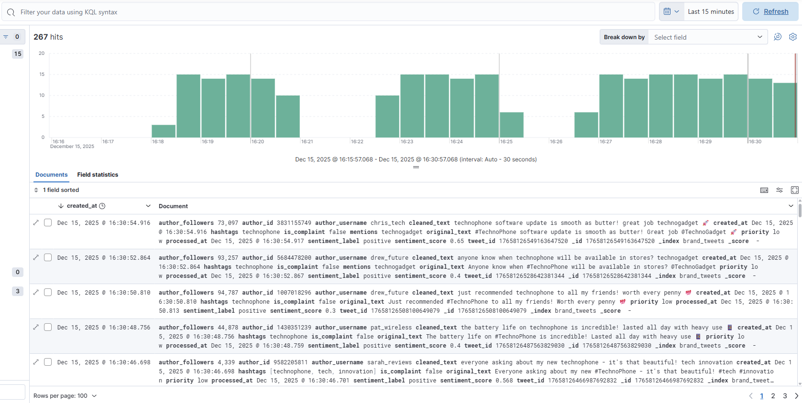
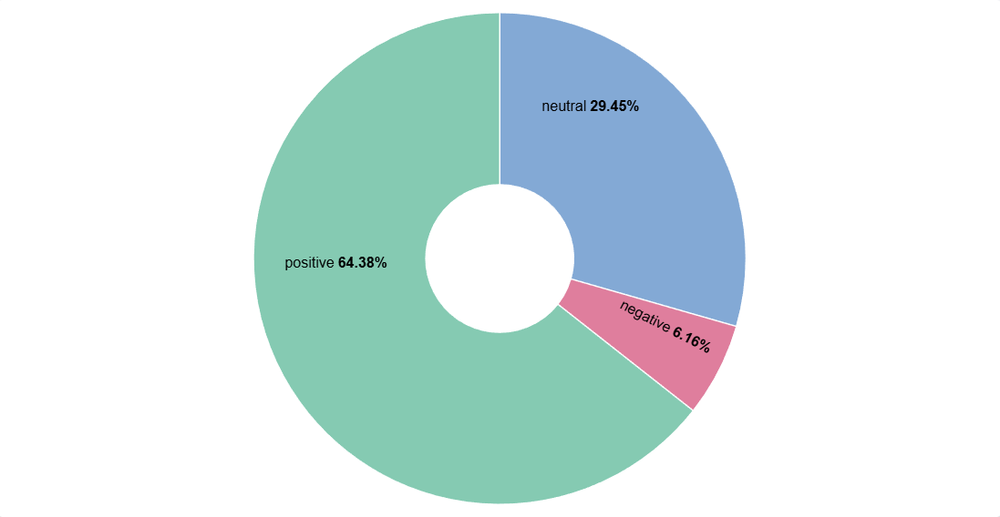
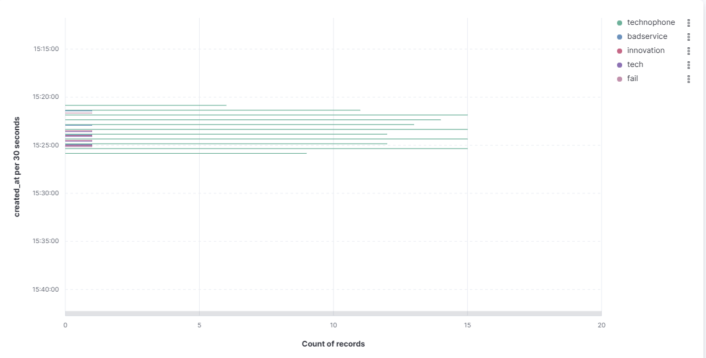
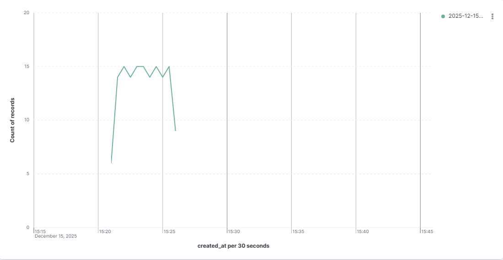
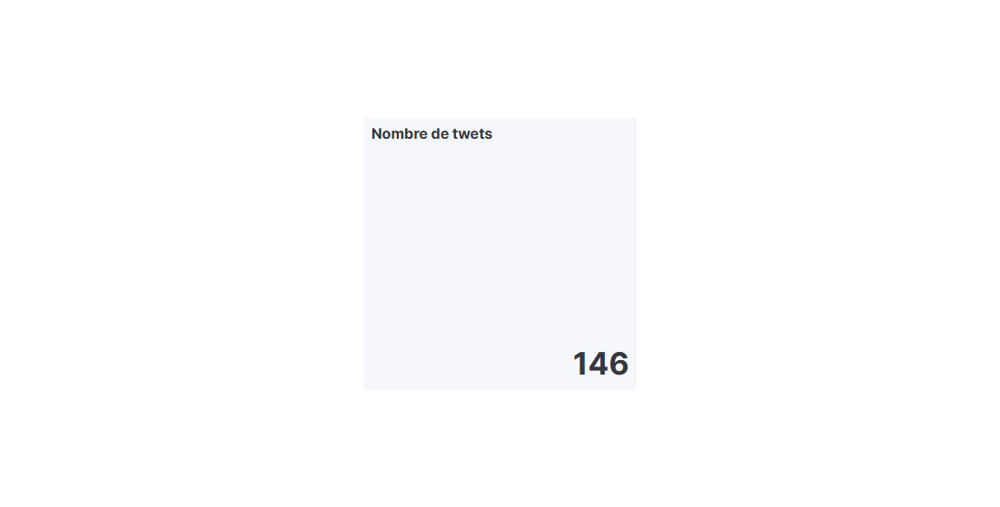
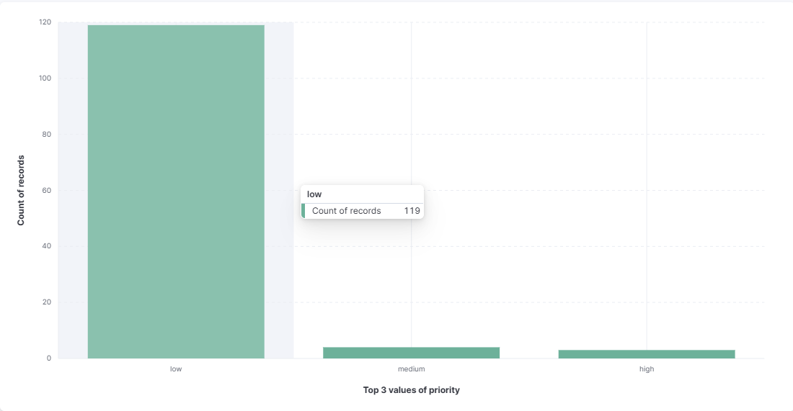

# Social Media Monitoring System for Brand Reputation

**A Real-Time Big Data Pipeline for Twitter Sentiment Analysis**

> Final Project — Big Data Introduction Course

---

## Table of Contents

1. [Project Overview](#1-project-overview)
2. [Architecture](#2-architecture)
3. [Technology Stack](#3-technology-stack)
4. [Quick Start](#4-quick-start)
5. [Detailed Setup](#5-detailed-setup)
6. [How It Works](#6-how-it-works)
7. [Using Kibana](#7-using-kibana)
8. [Project Structure](#8-project-structure)
9. [Configuration](#9-configuration)
10. [Data Management](#10-data-management)
11. [Troubleshooting](#11-troubleshooting)
12. [Screenshots](#12-screenshots)
13. [Challenges Encountered and Solutions](#13-challenges-encountered-and-solutions)
14. [My Setup Notes](#14-my-setup-notes)

---

## 1. Project Overview

### What This Project Is About

This project showcases a **real-time Big Data pipeline** designed to monitor brand reputation on social media platforms.

By simulating Twitter activity, the system performs **sentiment analysis in real time**, stores large volumes of data efficiently, and provides **interactive dashboards** for instant insights.

### What We Demonstrate

Through this project, we demonstrate:

- ✅ **Installation and configuration of Big Data tools** (Kafka, ElasticSearch, Kibana, Spark, Docker)
- ✅ **Real-time data ingestion and processing** (tweets generated and indexed instantly)
- ✅ **Integration of multiple components** into a unified architecture
- ✅ **Practical problem-solving** in a distributed environment

---

### Business Use Case

**Scenario**: A company called **TechnoGadget Inc.** just launched their new smartphone, the **#TechnoPhone**. They want to know what customers are saying about it on Twitter.

**The Problem**:
- Thousands of tweets are posted every day about the product
- The marketing team cannot read all tweets manually
- They need to detect negative feedback quickly to respond to customers
- They want to see trends and patterns in real-time

**Our Solution**:
A Big Data pipeline that automatically:
1. Collects tweets mentioning the brand (simulated in our case)
2. Analyzes the sentiment of each tweet (positive, negative, neutral)
3. Stores everything in a searchable database (ElasticSearch)
4. Shows real-time dashboards for the marketing team (Kibana)

**Business Goals**:
| Goal | How We Achieve It |
|------|-------------------|
| Track customer sentiment | Pie chart showing positive/negative/neutral distribution |
| Detect complaint spikes | Alert when negative tweets increase suddenly |
| Find trending hashtags | Bar chart showing most used hashtags |
| Monitor influencer mentions | Filter tweets by follower count |
| Respond quickly to issues | Priority system (high/medium/low) for complaints |

---

### Important Note: Twitter API Alternative

#### Why We Don't Use the Real Twitter API

The Twitter (X) API is **not free anymore**:
- Basic API access costs **$100/month**
- Pro API access costs **$5,000/month**
- Free tier is very limited (read-only, 1,500 tweets/month)

#### Our Solution: Tweet Simulator

Instead of paying for API access, we made a **Tweet Simulator** that:
- Generates realistic fake tweets about the brand
- Includes different sentiments (positive, negative, neutral)
- Simulates real Twitter data (usernames, followers, hashtags)
- Sends tweets directly to ElasticSearch in real-time
- Uses unique IDs to avoid duplicate data
- Allows testing the full Big Data architecture for free

This approach shows the same technical concepts while being **completely free to run**.

---

## 2. Architecture

### System Architecture Diagram

```
┌─────────────────────────────────────────────────────────────────────────────────┐
│                           BRAND MONITORING SYSTEM                                │
└─────────────────────────────────────────────────────────────────────────────────┘

    ┌──────────────────┐      ┌──────────────┐      ┌──────────────┐
    │                  │      │              │      │              │
    │  TWEET SIMULATOR │─────▶│    KAFKA     │      │   KIBANA     │
    │  (Fake Tweets)   │      │  (Buffering) │      │  (Dashboard) │
    │                  │      │              │      │              │
    └────────┬─────────┘      └──────────────┘      └──────▲───────┘
             │                                              │
             │                                              │
             │         ┌──────────────────────┐             │
             └────────▶│                      │─────────────┘
                       │    ELASTICSEARCH     │
                       │  (Storage & Search)  │
                       │                      │
                       └──────────────────────┘
```

### Data Flow

1. **Tweet Simulator** generates realistic fake tweets with unique IDs
2. Tweets go to **Kafka** (for buffering) AND **ElasticSearch** (for storage)
3. **ElasticSearch** stores and indexes tweets with full-text search
4. **Kibana** shows real-time dashboards and visualizations

> **Note**: The Tweet Simulator does sentiment analysis before sending to ElasticSearch. We don't need Apache Spark for processing.

### What is ElasticSearch?

**ElasticSearch** is a search and analytics engine. Think of it like a very powerful database that is good at:

| Feature | What It Does | Example in Our Project |
|---------|-------------|------------------------|
| **Fast Search** | Find data very quickly, even with millions of documents | Search tweets containing "battery" in milliseconds |
| **Full-Text Search** | Search inside text, not just exact matches | Find tweets about "problems" even if they say "issue" |
| **Real-Time Indexing** | Data is searchable immediately after inserting | New tweets appear in Kibana within 1 second |
| **Aggregations** | Calculate statistics on the fly | Count tweets per sentiment, average score, etc. |
| **JSON Documents** | Stores data as JSON, easy to work with | Each tweet is one JSON document |

**In our project, ElasticSearch:**
- Stores all tweets in an index called `brand_tweets`
- Creates a mapping (schema) to define field types (text, number, date, etc.)
- Allows Kibana to query and aggregate data for dashboards
- Keeps data even when Docker containers restart (using volumes)

### What is Kibana?

**Kibana** is the visualization tool for ElasticSearch. It connects to ElasticSearch and lets you:

| Feature | What It Does | Example in Our Project |
|---------|-------------|------------------------|
| **Discover** | Browse and search raw data | See all tweets, filter by sentiment |
| **Visualizations** | Create charts and graphs | Pie chart for sentiment distribution |
| **Dashboards** | Combine multiple visualizations | Overview with all charts in one page |
| **Real-Time Updates** | Auto-refresh to show new data | Watch tweets appear as they are generated |
| **Filters** | Filter data by any field | Show only negative tweets from last hour |

**In our project, Kibana shows:**
- **Pie Chart**: How many tweets are positive/negative/neutral (sentiment distribution)
- **Bar Chart**: Which hashtags are used the most (trending topics)
- **Line Chart**: How many tweets per hour/day (volume over time)
- **Metric**: Total tweet count, average sentiment score
- **Data Table**: List of customer complaints needing attention

### How ElasticSearch and Kibana Work Together

```
┌─────────────────────────────────────────────────────────────────────────┐
│                        ELASTICSEARCH + KIBANA                            │
├─────────────────────────────────────────────────────────────────────────┤
│                                                                          │
│   TWEET SIMULATOR                                                        │
│        │                                                                 │
│        │ Sends JSON documents                                            │
│        ▼                                                                 │
│   ┌─────────────────────────────────────────────────────────────────┐   │
│   │                      ELASTICSEARCH                               │   │
│   │                                                                  │   │
│   │  ┌─────────────┐   ┌─────────────┐   ┌─────────────┐            │   │
│   │  │   Tweet 1   │   │   Tweet 2   │   │   Tweet 3   │  ...       │   │
│   │  │ sentiment:+ │   │ sentiment:- │   │ sentiment:0 │            │   │
│   │  │ hashtags:[] │   │ hashtags:[] │   │ hashtags:[] │            │   │
│   │  └─────────────┘   └─────────────┘   └─────────────┘            │   │
│   │                                                                  │   │
│   │  Index: brand_tweets                                             │   │
│   │  Total documents: 500+                                           │   │
│   └─────────────────────────────────────────────────────────────────┘   │
│        │                                                                 │
│        │ Kibana queries ElasticSearch                                    │
│        ▼                                                                 │
│   ┌─────────────────────────────────────────────────────────────────┐   │
│   │                         KIBANA                                   │   │
│   │                                                                  │   │
│   │  ┌──────────┐  ┌──────────┐  ┌──────────┐  ┌──────────┐         │   │
│   │  │ PIE CHART│  │ BAR CHART│  │LINE CHART│  │  METRIC  │         │   │
│   │  │  40% +   │  │ #techno  │  │  ___/\   │  │   523    │         │   │
│   │  │  35% -   │  │ #phone   │  │ /    \   │  │  tweets  │         │   │
│   │  │  25% 0   │  │ #tech    │  │/      \_ │  │          │         │   │
│   │  └──────────┘  └──────────┘  └──────────┘  └──────────┘         │   │
│   │                                                                  │   │
│   │  URL: http://localhost:5601                                      │   │
│   └─────────────────────────────────────────────────────────────────┘   │
│                                                                          │
└─────────────────────────────────────────────────────────────────────────┘
```

**Step by step:**

1. **Tweet Simulator** creates a tweet with sentiment analysis
2. Tweet is sent to **ElasticSearch** as a JSON document
3. ElasticSearch **indexes** the tweet (makes it searchable)
4. **Kibana** queries ElasticSearch: "give me count of tweets grouped by sentiment"
5. ElasticSearch returns: `{positive: 200, negative: 175, neutral: 125}`
6. Kibana **draws** a pie chart with these numbers
7. Dashboard **auto-refreshes** every 5 seconds to show new data

---

## 3. Technology Stack

| Component | Technology | Version | Purpose |
|-----------|------------|---------|---------|
| **Message Broker** | Apache Kafka | 7.5.0 | Buffering and message queuing |
| **Coordination** | Zookeeper | 7.5.0 | Kafka cluster coordination |
| **Search Engine** | ElasticSearch | 8.11.0 | Data storage and full-text search |
| **Visualization** | Kibana | 8.11.0 | Dashboards and analytics |
| **Processing** | Apache Spark | 3.5.0 | Stream processing (optional) |
| **Sentiment Analysis** | TextBlob | 0.17.1 | NLP sentiment scoring |
| **Language** | Python | 3.10+ | Application code |
| **Containerization** | Docker | Latest | Service orchestration |

### Python Dependencies

```
tweepy>=4.14.0          # Twitter API client (for reference)
kafka-python>=2.0.2     # Kafka producer/consumer
textblob>=0.17.1        # Sentiment analysis
nltk>=3.8.1             # Natural language processing
pyspark>=3.5.0          # Spark integration
elasticsearch>=8.11.0   # ElasticSearch client
python-dotenv>=1.0.0    # Environment variables
requests>=2.31.0        # HTTP requests
```

### Why We Selected These Tools

| Tool | Why We Chose It |
|------|-----------------|
| **Apache Kafka** | Industry standard for real-time data streaming. Handles high volume of messages with low latency. Perfect for ingesting thousands of tweets per second. |
| **ElasticSearch** | Very fast search and aggregation on large datasets. Built-in JSON support makes it perfect for tweet data. Easy to scale horizontally. |
| **Kibana** | Native integration with ElasticSearch. No code needed to create dashboards. Real-time visualization out of the box. |
| **Docker** | Easy setup - one command starts everything. Same environment on any machine. No "it works on my computer" problems. |
| **TextBlob** | Simple Python library for sentiment analysis. No machine learning training needed. Good enough accuracy for demonstration. |
| **Python** | Easy to read and write. Many libraries for Big Data (kafka-python, elasticsearch, textblob). Fast development. |

### How These Tools Fit in a Big Data Ecosystem

```
┌─────────────────────────────────────────────────────────────────────────────┐
│                         BIG DATA ECOSYSTEM                                   │
├─────────────────────────────────────────────────────────────────────────────┤
│                                                                              │
│   DATA SOURCES          INGESTION         PROCESSING         STORAGE        │
│   ┌──────────┐         ┌─────────┐       ┌─────────┐       ┌─────────┐     │
│   │ Twitter  │         │  KAFKA  │       │  SPARK  │       │ELASTIC- │     │
│   │ Facebook │ ──────▶│(message │──────▶│(batch & │──────▶│ SEARCH  │     │
│   │ Sensors  │         │ queue)  │       │ stream) │       │(search) │     │
│   │ Logs     │         └─────────┘       └─────────┘       └────┬────┘     │
│   └──────────┘                                                   │          │
│                                                                  ▼          │
│                         VISUALIZATION                        ┌─────────┐   │
│                         ┌──────────────────────────────────▶│ KIBANA  │   │
│                         │                                    │(charts) │   │
│                         │                                    └─────────┘   │
│                         │                                                   │
│   OUR PROJECT:          │                                                   │
│   ┌──────────┐         ┌─────────┐                         ┌─────────┐     │
│   │  TWEET   │         │  KAFKA  │                         │ELASTIC- │     │
│   │SIMULATOR │  ──────▶│(buffer) │────────────────────────▶│ SEARCH  │     │
│   └──────────┘         └─────────┘                         └────┬────┘     │
│        │                                                         │          │
│        │              (Sentiment analysis done in simulator)     │          │
│        └─────────────────────────────────────────────────────────┼─────┐    │
│                                                                  ▼     ▼    │
│                                                           ┌─────────────┐   │
│                                                           │   KIBANA    │   │
│                                                           │ (dashboard) │   │
│                                                           └─────────────┘   │
│                                                                              │
└─────────────────────────────────────────────────────────────────────────────┘
```

**Our simplified architecture** shows the same concepts as enterprise Big Data systems:
- **Kafka** = Message queue for decoupling producers from consumers
- **ElasticSearch** = NoSQL database optimized for search and analytics
- **Kibana** = Business Intelligence tool for non-technical users

---

## 4. Quick Start

### Prerequisites

Before starting, make sure you have:
- **Docker Desktop** installed and running
- **Python 3.10+** installed
- **pip** package manager

### One-Click Start

1. **Clone the repository** (if not already done)

2. **Install Python dependencies**:
   ```powershell
   pip install -r requirements.txt
   ```

3. **Start the pipeline**:
   ```
   Double-click: start_pipeline.bat
   ```

4. **View the dashboard**:
   - Kibana will open automatically at http://localhost:5601
   - Go to **Analytics → Discover** to see tweets

5. **Stop the pipeline**:
   ```
   Double-click: stop_pipeline.bat
   ```
   Or press `Ctrl+C` in the terminal, then run:
   ```powershell
   docker-compose down
   ```

---

## 5. Detailed Setup

### Step 1: Install Dependencies

```powershell
cd C:\path\to\BigDataProject
pip install -r requirements.txt
```

### Step 2: Start Docker Containers

```powershell
docker-compose up -d
```

This starts:
- Zookeeper (port 2181)
- Kafka (port 9092, 29092)
- Spark Master (port 8080, 7077)
- Spark Worker (port 8081)
- ElasticSearch (port 9200)
- Kibana (port 5601)

### Step 3: Wait for Services

Wait about 45 seconds for all services to start, especially ElasticSearch.

### Step 4: Create Kafka Topics

```powershell
docker exec kafka kafka-topics --bootstrap-server localhost:9092 --create --if-not-exists --topic tweets_raw --partitions 6 --replication-factor 1
```

### Step 5: Load Sample Data (Optional)

```powershell
python src/utils/load_sample_data.py
```

### Step 6: Run Tweet Simulator

```powershell
python src/ingestion/tweet_simulator.py
```

---

## 6. How It Works

### Batch Scripts Explained

#### `start_pipeline.bat`

This script starts everything automatically:

| Step | Action | Description |
|------|--------|-------------|
| 1/6 | Start Docker | Runs `docker-compose up -d` to start all containers |
| 2/6 | Wait | Waits 45 seconds for services to start |
| 3/6 | Check ES | Loops until ElasticSearch responds |
| 4/6 | Create Topics | Creates Kafka topics for tweet streaming |
| 5/6 | Check Data | Loads sample data only if index is empty |
| 6/6 | Start Simulator | Opens Kibana and starts generating tweets |

**Important**: Your data is **saved** between restarts! The script checks if data exists before loading samples.

#### `stop_pipeline.bat`

Stops all Docker containers:
```batch
docker-compose down
```

### Tweet Simulator

The simulator (`src/ingestion/tweet_simulator.py`) generates realistic tweets:

**Sentiment Distribution**:
- 50% Positive tweets
- 25% Negative tweets
- 25% Neutral tweets

**Features**:
- Realistic tweet templates with emojis
- Random usernames and follower counts
- Hashtag extraction
- Sentiment analysis using TextBlob
- Direct sending to ElasticSearch
- **Unique tweet IDs** (timestamp + random) to avoid duplicates

**Sample Generated Tweet**:
```json
{
  "tweet_id": "17340129515234561234",
  "original_text": "Just got my new #TechnoPhone and I'm absolutely in love! @TechnoGadget",
  "sentiment_label": "positive",
  "sentiment_score": 0.65,
  "hashtags": ["technophone"],
  "author_username": "tech_lover_92",
  "author_followers": 1523,
  "is_complaint": false,
  "created_at": "2024-12-15T15:00:00Z"
}
```

---

## 7. Using Kibana

### Access Kibana

Open your browser and go to: **http://localhost:5601**

### View Tweet Data

1. Click the **menu icon** (top left)
2. Go to **Analytics → Discover**
3. Select `brand_tweets` from the dropdown
4. Change the time range to **"Last 7 days"** or **"Last 15 minutes"**

### Create Visualizations

1. Go to **Analytics → Dashboard**
2. Click **Create dashboard**
3. Click **Create visualization**

**Recommended visualizations**:

| Visualization | Field | Purpose |
|--------------|-------|---------|
| **Pie Chart** | `sentiment_label` | Sentiment distribution |
| **Bar Chart** | `hashtags` | Top trending hashtags |
| **Line Chart** | `created_at` | Tweet volume over time |
| **Tag Cloud** | `hashtags` | Word cloud of hashtags |
| **Metric** | `sentiment_score` (avg) | Average sentiment |
| **Data Table** | Filter `is_complaint: true` | Customer complaints |

### Available Fields

| Field | Type | Description |
|-------|------|-------------|
| `tweet_id` | keyword | Unique tweet identifier |
| `sentiment_label` | keyword | positive, negative, or neutral |
| `sentiment_score` | float | -1.0 to +1.0 sentiment value |
| `hashtags` | keyword | Array of hashtags used |
| `mentions` | keyword | Array of mentioned users |
| `author_username` | keyword | Twitter username |
| `author_followers` | integer | Follower count |
| `is_complaint` | boolean | True if tweet is a complaint |
| `priority` | keyword | high, medium, or low |
| `created_at` | date | Tweet timestamp |
| `processed_at` | date | Processing timestamp |

---

## 8. Project Structure

```
BigDataProject/
│
├── docker-compose.yml        # Docker services configuration
├── requirements.txt          # Python dependencies
├── .env.example              # Environment variables template
├── README.md                 # This documentation
│
├── start_pipeline.bat        # One-click startup script
├── stop_pipeline.bat         # One-click shutdown script
│
├── src/
│   ├── ingestion/
│   │   ├── tweet_simulator.py    # Generates fake tweets → ES
│   │   └── twitter_producer.py   # Real Twitter API (requires paid API)
│   │
│   ├── processing/
│   │   └── spark_processor.py    # Spark streaming processor
│   │
│   └── utils/
│       ├── load_sample_data.py   # Loads initial sample data
│       └── reset_data.py         # Deletes all data (with confirmation)
│
├── data/
│   ├── sample_tweets.json        # Example tweet data
│   └── processed_tweets.json     # Example processed data
│
├── screens/                      # Screenshots for documentation
│
└── scripts/
    ├── start_pipeline.sh         # Linux startup script
    └── create_es_index.sh        # ElasticSearch index setup
```

---

## 9. Configuration

### Environment Variables

Copy `.env.example` to `.env` and configure:

```env
# Kafka Configuration
KAFKA_BOOTSTRAP_SERVERS=localhost:29092
KAFKA_TOPIC=tweets_raw

# ElasticSearch Configuration
ELASTICSEARCH_NODES=http://localhost:9200
ELASTICSEARCH_INDEX=brand_tweets

# Brand Monitoring Keywords
TRACK_KEYWORDS=TechnoGadget,TechnoPhone,#TechnoPhone
```

### Tweet Simulator Options

```powershell
python src/ingestion/tweet_simulator.py --help

Options:
  --kafka    Kafka bootstrap servers (default: localhost:29092)
  --topic    Kafka topic (default: tweets_raw)
  --es       ElasticSearch host (default: http://localhost:9200)
  --index    ElasticSearch index (default: brand_tweets)
  --rate     Tweets per minute (default: 30)
  --duration Duration in minutes, 0=forever (default: 5)
```

**Example**: Generate 60 tweets/minute for 10 minutes:
```powershell
python src/ingestion/tweet_simulator.py --rate 60 --duration 10
```

---

## 10. Data Management

### Data Persistence

Your tweet data is **automatically saved** between restarts:

| Action | Data Status |
|--------|-------------|
| `start_pipeline.bat` | Data saved, new tweets added |
| `stop_pipeline.bat` | Data saved in Docker volumes |
| `docker-compose down` | Data saved |
| `docker-compose down -v` | **ALL DATA DELETED** |

### Reset All Data

If you want to start fresh and delete all tweets:

```powershell
python src/utils/reset_data.py
```

You will need to type `DELETE` to confirm.

### Check Tweet Count

```powershell
curl http://localhost:9200/brand_tweets/_count
```

---

## 11. Troubleshooting

### Common Issues

#### Docker containers won't start

```
Error: Cannot connect to the Docker daemon
```
**Solution**: Make sure Docker Desktop is running.

#### ElasticSearch not ready

```
Error: Connection refused localhost:9200
```
**Solution**: Wait longer for ElasticSearch to start (up to 60 seconds).

#### Kibana shows no data

**Solutions**:
1. Change time filter to **"Last 7 days"**
2. Check data exists: `curl http://localhost:9200/brand_tweets/_count`
3. Run `python src/utils/load_sample_data.py`

#### Python dependency errors

```powershell
pip install --upgrade pip
pip install -r requirements.txt
```

### Service URLs

| Service | URL |
|---------|-----|
| Kibana Dashboard | http://localhost:5601 |
| ElasticSearch | http://localhost:9200 |
| Spark Master UI | http://localhost:8080 |
| Spark Worker UI | http://localhost:8081 |

### Useful Commands

```powershell
# Check running containers
docker-compose ps

# View container logs
docker-compose logs -f elasticsearch
docker-compose logs -f kafka

# Restart a specific service
docker-compose restart elasticsearch

# Stop all containers
docker-compose down

# Stop and remove all data
docker-compose down -v
```

---

## 12. Screenshots

This section shows screenshots of the project in action.

---

### 12.1 Pipeline Startup - Step 1



**Description**: Starting the `start_pipeline.bat` script. First step shows Docker containers starting with `docker-compose up -d`.

---

### 12.2 Pipeline Startup - Step 2


**Description**: The script waits for services to start (45 seconds timeout). This gives ElasticSearch time to initialize.

---

### 12.3 Pipeline Startup - Step 3


**Description**: Checking ElasticSearch connection. The script loops until ElasticSearch responds to make sure the service is ready.

---

### 12.4 Pipeline Startup - Step 4


**Description**: Creating Kafka topics (`tweets_raw`, `tweets_processed`, `tweets_alerts`) and checking ElasticSearch index status.

---

### 12.5 Pipeline Startup - Step 5



**Description**: Pipeline is ready! Shows service URLs (Kibana, Spark, ElasticSearch) and confirms that previous data is saved.

---

### 12.6 Tweet Simulator - Generation


**Description**: Tweet Simulator running and generating realistic tweets. Each tweet is analyzed for sentiment (positive, negative, neutral) before being sent to ElasticSearch.

---

### 12.7 Tweet Simulator - Continued



**Description**: More tweets being generated. The simulator shows tweet content, sentiment label, simulated username and confirms sending to ElasticSearch.

---

### 12.8 Tweet Simulator - More Tweets



**Description**: Simulator continues generating various tweets with different sentiments and hashtags (#TechnoPhone, @TechnoGadget), simulating realistic Twitter traffic.

---

### 12.9 Kibana - Discover Page



**Description**: Kibana Discover page showing all tweets in ElasticSearch. You can see fields like `sentiment_label`, `author_username`, `hashtags`, `text` and `created_at`. The hit counter shows total number of documents.

---

### 12.10 Visualization - Pie Chart (Sentiment Distribution)



**Description**: Pie chart showing sentiment distribution:
- **Positive**: Good tweets about the brand
- **Negative**: Bad tweets and complaints
- **Neutral**: Neither good nor bad

This chart helps understand overall brand perception quickly.

---

### 12.11 Visualization - Bar Chart (Top Hashtags)



**Description**: Horizontal bar chart showing most used hashtags. Helps identify trending topics and marketing campaign effectiveness.

---

### 12.12 Visualization - Line Chart (Tweet Volume Over Time)



**Description**: Line chart showing tweet volume over time. Useful to detect activity spikes, viral events or sentiment changes.

---

### 12.13 Visualization - Metric (Total Tweets)



**Description**: Metric widget showing total number of tweets in ElasticSearch. Allows real-time tracking of data volume.

---

### 12.14 Visualization - Metric (Average Sentiment Score)


**Description**: Metric widget showing average sentiment score. Positive value means good brand perception, negative value means reputation problems.

---

### 12.15 Visualization - Priority Distribution



**Description**: Chart showing priority distribution (high, medium, low). High priority tweets are usually complaints from customers with many followers, needing fast customer service response.

---

## 13. Challenges Encountered and Solutions

During the development of this project, we faced several technical challenges. Here is how we solved them:

### Challenge 1: ElasticSearch Client Version Compatibility

**Problem**: The Python `elasticsearch` library version 8.x changed its API. The old way of connecting didn't work anymore.

**Error message**:
```
TypeError: __init__() got an unexpected keyword argument 'hosts'
```

**Solution**: Updated the connection code to use the new API:
```python
# OLD (doesn't work with ES 8.x)
es = Elasticsearch(hosts=['localhost:9200'])

# NEW (works with ES 8.x)
es = Elasticsearch(['http://localhost:9200'])
```

---

### Challenge 2: Spark Docker Image Not Found

**Problem**: The Spark Docker image we tried to use didn't exist in the registry.

**Error message**:
```
manifest for bitnami/spark:3.5.0 not found
```

**Solution**: Changed the docker-compose.yml to use the correct image tag:
```yaml
# OLD (doesn't exist)
image: bitnami/spark:3.5.0

# NEW (exists and works)
image: bitnami/spark:3.5
```

---

### Challenge 3: Data Loss on Restart

**Problem**: Every time we restarted the pipeline with `start_pipeline.bat`, all our tweets were deleted and replaced with sample data.

**Root cause**: The `load_sample_data.py` script was deleting the index every time it ran.

**Solution**: Modified the script to check if data exists before loading:
```python
# Check if index exists and has data
if es.indices.exists(index=INDEX_NAME):
    count = es.count(index=INDEX_NAME)["count"]
    if count > 0:
        print(f"✅ Index already has {count} tweets - keeping existing data")
        return  # Don't load sample data, preserve existing tweets
```

---

### Challenge 4: Duplicate Tweet IDs

**Problem**: When running the Tweet Simulator multiple times, new tweets would overwrite old tweets because they had the same IDs.

**Root cause**: Tweet IDs were sequential starting from 0 each time: `tweet_0`, `tweet_1`, `tweet_2`...

**Solution**: Generate truly unique IDs using timestamp + random number:
```python
# OLD (causes duplicates)
tweet_id = f"tweet_{counter}"

# NEW (always unique)
unique_id = f"{int(time.time() * 1000000)}{random.randint(1000, 9999)}"
```

---

### Challenge 5: ElasticSearch Takes Long to Start

**Problem**: The script tried to connect to ElasticSearch before it was ready, causing connection errors.

**Solution**: Added a retry loop with timeout:
```batch
:wait_es
echo Waiting for ElasticSearch...
curl -s http://localhost:9200 > nul 2>&1
if errorlevel 1 (
    timeout /t 5 /nobreak > nul
    goto wait_es
)
echo ElasticSearch is ready!
```

---

## 14. My Setup Notes

This section describes specific problems I struggled with and how I solved them. This is my personal learning experience.

### Problem: Kibana Shows "No Data" Even Though Data Exists

**What happened**: 
I ran the Tweet Simulator, saw tweets being generated in the terminal, but Kibana Discover page showed "No results found".

**My debugging process**:

1. **First, I checked if data was in ElasticSearch**:
   ```powershell
   curl http://localhost:9200/brand_tweets/_count
   ```
   Result: `{"count":150}` - Data exists!

2. **Then I checked the time range in Kibana**:
   The default was "Last 15 minutes", but my tweets had timestamps from yesterday (sample data).

3. **Solution**: Changed the time filter to "Last 7 days" in Kibana.

**Screenshot of the problem**:

The Kibana interface showing the time picker that I needed to change.

**What I learned**: Always check the time range when Kibana shows no data. ElasticSearch stores timestamps, and Kibana filters by time.

---

### Problem: Docker Containers Keep Restarting

**What happened**:
After running `docker-compose up -d`, the ElasticSearch container kept restarting in a loop.

**My debugging process**:

1. **Checked container logs**:
   ```powershell
   docker-compose logs elasticsearch
   ```
   
2. **Found the error**:
   ```
   ERROR: max virtual memory areas vm.max_map_count [65530] is too low
   ```

3. **Solution for Windows with WSL2**:
   ```powershell
   wsl -d docker-desktop
   sysctl -w vm.max_map_count=262144
   ```

**What I learned**: ElasticSearch needs specific Linux kernel settings. On Windows with Docker Desktop, you need to configure WSL2.

---

### Problem: Understanding How Kibana Visualizations Work

**What I struggled with**:
I didn't understand how to create a pie chart. The interface was confusing with "metrics" and "buckets".

**What I learned**:

1. **Metrics** = What you want to measure (count, average, sum)
2. **Buckets** = How you want to group the data (by sentiment, by date, by hashtag)

**Example for sentiment pie chart**:
- Metric: **Count** (how many tweets)
- Bucket: **Terms** on field `sentiment_label` (group by positive/negative/neutral)

**My step-by-step process**:
1. Go to Kibana → Visualize Library → Create visualization
2. Choose "Pie"
3. Select `brand_tweets` data view
4. Add bucket → Split slices → Terms → `sentiment_label`
5. Click "Update"

---

### Problem: Python Package Conflicts

**What happened**:
Running `pip install -r requirements.txt` gave errors about incompatible versions.

**Error**:
```
ERROR: pip's dependency resolver does not currently take into account all the packages that are installed.
```

**My solution**:
1. Created a virtual environment:
   ```powershell
   python -m venv venv
   venv\Scripts\activate
   ```
2. Installed packages in the clean environment:
   ```powershell
   pip install -r requirements.txt
   ```

**What I learned**: Always use virtual environments to avoid package conflicts.

---

### Key Takeaways from This Project

1. **Docker makes Big Data easy** - Instead of installing Kafka, ElasticSearch, Kibana manually, one `docker-compose up` command starts everything.

2. **Real-time data is complex** - Many things can go wrong: connection timeouts, data duplication, timestamp issues.

3. **Debugging is important** - Always check logs (`docker-compose logs`), verify data exists (`curl`), and check configurations.

4. **Documentation matters** - Writing this README helped me understand the system better.

---

## License

This project is for educational purposes as part of a Big Data course.

---

## Authors

Big Data Introduction Course - Final Project

---

## Acknowledgments

- Apache Kafka for distributed streaming
- Elastic Stack for search and visualization
- TextBlob for sentiment analysis
- Docker for containerization
